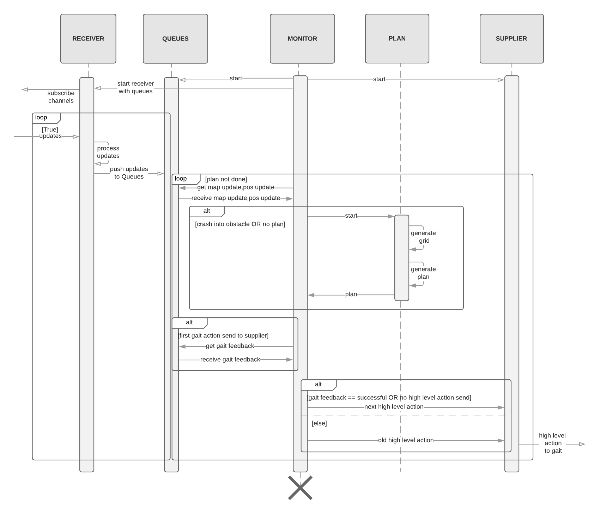

# High Level Controller

## Overview

The control-high repository consists of the High-Level Controller and the MHIST submodule of the SOZO Robotics Project.

The High-Level Controller (HLC) receives the area to cover from the Swarm Algorithm (tbd, currently mocked), gets updates about the local map and the current position in the map from [SLAM](https://github.com/codeuniversity/slam) and feedback about the (sucessful) leg movement from the [gait controller](https://github.com/codeuniversity/control-gait).
The Planning Alogorithm creates the high level actions (hla) to ensure a sucessful exploration of the area the robot should cover. You can test the algorithms with the pytests defined in /test. These hla ("move forward" or "turn by 90 degrees") are forwarded to the gait controller.

## Project Structure

The "Monitor" is the main Process, that is starting the subprocesses "Queues", "Receiver", "Supplier" and "Plan". The receiver subscribes to MHIST, a simple on disc measurement data base that stores and redistributes measurements consisting of a name, a value and optionally a timestamp through grpc.
The output, the hla, are pushed to MHIST and then pulled from the gait controller.

## To Do

- [ ] Planning Algorithm
  - [x] no obstacles
  - [ ] obstacle avoidance
- [x] Tests for Planning Algorithm
- [ ] Grid Generator
- [ ] Monitor
- [x] Receiver with Queues
- [ ] Supplier

